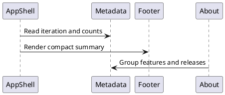

# Application iterations and feature metadata

The `src/meta` modules are the UI source of truth for application version, current iteration, supported scope, implemented features, latest feature IDs, release notes, known limitations, and documented roadmap. The shared semantic footer renders compact derived totals; `#/about` renders the complete registry grouped by category and keeps the latest release visually separate.

Every completed iteration must update:

1. `CURRENT_ITERATION`;
2. the package/application version when applicable;
3. `IMPLEMENTED_FEATURES`;
4. `LATEST_ITERATION_FEATURE_IDS`;
5. `RELEASE_NOTES`;
6. `KNOWN_LIMITATIONS`;
7. the README current status.

Metadata tests require unique implemented and latest IDs, a nonempty latest list, resolvable release-note references, introduced-iteration values, and a release note matching the current iteration. Planned work belongs only in the clearly labelled roadmap and must never appear as implemented.

