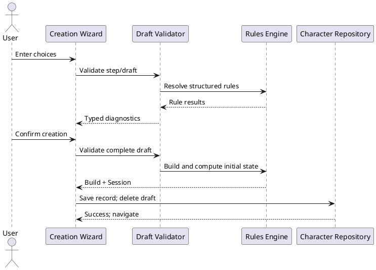
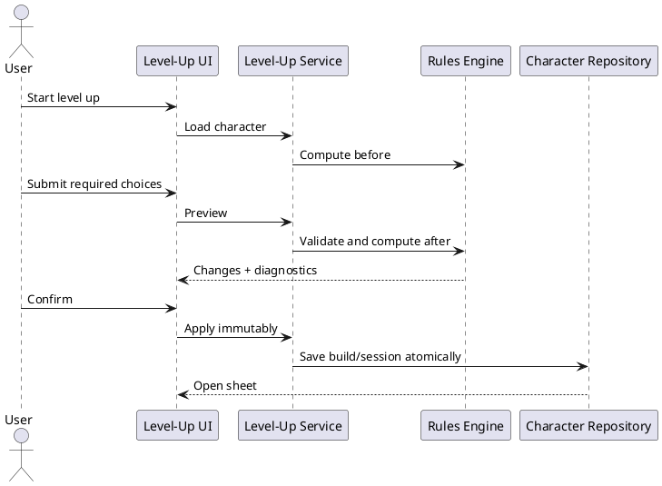

# Iteration 2C — Character creation and level-up

## Workflow and draft lifecycle

The UI collects one focused group at a time and persists immutable schema-v1 draft snapshots separately from completed characters. Step validation provides concise feedback; final validation is authoritative. Confirmation converts the draft with the domain service, computes initial HP/resources through the existing engine, atomically saves build plus session, removes the draft, and opens the stable character route. Cancel requires confirmation. Derived values are preview-only.

## Validation pipeline

Pure domain modules validate Standard Array assignment, verified 27-point cost data (scores 8–15), strict Manual values, Farmer +2/+1 or +1/+1/+1 adjustments, skill overlap/count, the single MVP equipment preset, cantrip/list/count rules, prepared-spell access through the existing preparation validator, subclass/land timing, and an explicit fixed HP gain for every level. Typed diagnostics block conversion; failure returns no partial build.

## Creation and persistence

`createCharacterFromDraft` safely trims the name, materializes permanent choices, and uses the shared computation/resource pipeline. Initial current HP equals computed maximum HP; temporary HP, spent slots, spent Hit Dice, and conditions start empty; remaining-use resources start at their resolved maxima. The storage adapter uses safe JSON parsing, record guards, schema versions, corruption filtering, and reference-ID protection. The legacy reference presentation store remains independent and intact.

## Level-up

The level-up service verifies a one-level Druid transition, fixed HP gain, revised spell selections, and the level-3 subclass/land decision. Preview computes both sides with the same character engine and returns domain-generated changes. Apply returns new immutable build/session values, preserves current and temporary HP and prior resource spending, retains valid spent slots, and does not invoke rest recovery.

## Coverage and deferred features

Vitest covers ability generators, valid/invalid creation, initialized sessions, stable IDs, repository CRUD and draft lifecycle, corrupt-data behavior, atomic level-up failure, and HP preservation; existing rule, rest, reference, and React tests remain enabled. Deferred work includes other classes/origins/subclasses, multiclassing, levels above 8, purchases/encumbrance, rolled HP, spell effects/descriptions, Wild Shape forms, uncertain spell replacement, cloud sync, and importing arbitrary builds.
