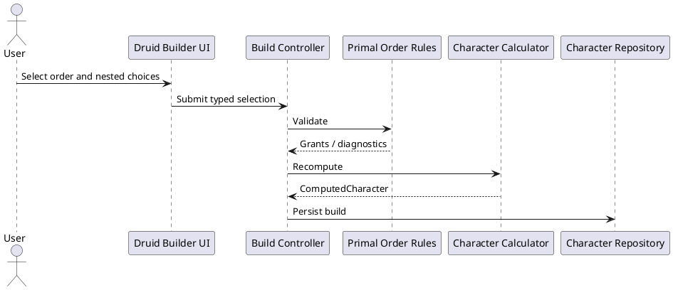
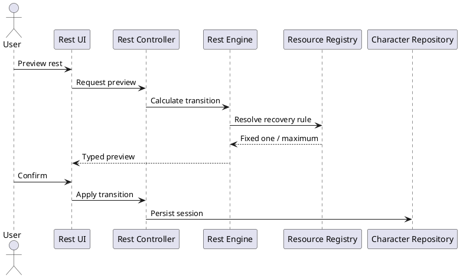

# Iteration 3.5A — Druid Primal Order and Wild Shape

## Architecture

`DruidPrimalOrderSelection` is a typed, permanent member of the Druid class build. The rules registry owns the two definitions and the domain validator owns nested-choice validation. Computation resolves grants: Magician adds a separately identified cantrip and a calculation step to Arcana or Nature (Wisdom modifier, minimum +1); Warden adds generic armor and weapon training. React only renders registry choices and computed presentation.

Existing user Druids without an order receive `missing-required-build-choice / druid.primal-order`; migration never guesses. Resolution validates a complete selection and atomically replaces the build. The reference character explicitly uses Warden, matching its martial level-eight presentation.

## Wild Shape and rests

The sole maximum table is the verified `wild-shape` resource definition: unavailable at level 1, two uses at levels 2–5, and three at levels 6–8. Its recovery rules restore one on a Short Rest and restore to maximum on a Long Rest. Domain preview and execution call the same transition, clamp to the maximum, and immutably preserve unrelated state. Level-up recomputes the maximum while persisted remaining uses are not automatically refilled.

## Coverage and limitations

Domain tests cover registry shape, nested validation, skill contributions, Warden grants, levels 1–8, rest preview/execution parity, immutability, and migration marking. Builder and summary tests cover the focused UI. Equipment purchasing, ASI/feats, subclass selection changes, forms, transformation, and spell-slot conversion remain intentionally deferred.
