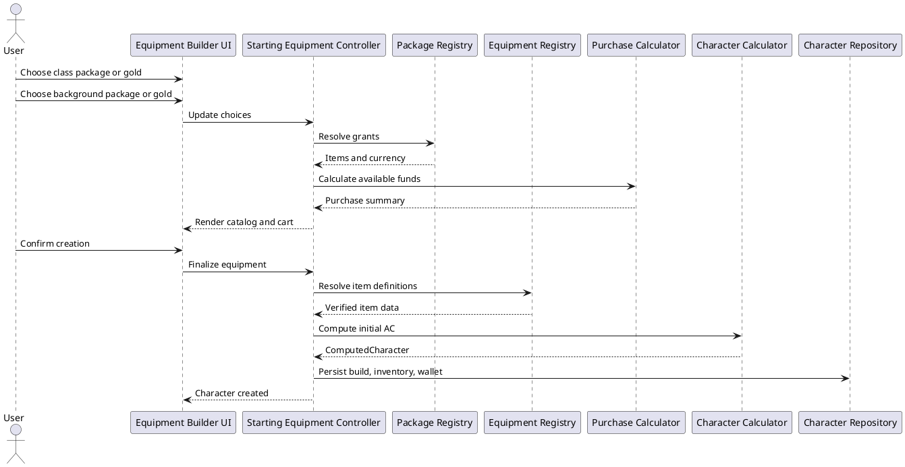
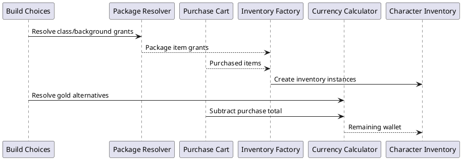

# Iteration 3.5B — Druid starting equipment and purchasing

## UI maintenance patch

The shared destructive-button treatment now uses a high-contrast red background,
white text, and explicit hover, active, focus-visible, and disabled states. Purchase
cart entries use one responsive grid row, allowing long equipment names to wrap
without displacing quantity or removal controls. The equipment picker also exposes
compact mechanics only where the verified registry already provides structured
weapon, armor, or shield fields.

Further Druidic Focus choices, multi-role quarterstaff modeling, price semantics,
and broader mechanics remain explicitly deferred to the equipment follow-up
backlog. This patch adds no focus choices and changes no equipment rules or prices.

## Architecture and verified definitions

`starting-equipment.ts` owns source choices, typed package/gold registries, exact wallet arithmetic, immutable cart commands, diagnostics, proficiency warnings, and inventory materialization. React renders these results and sends intent back to commands; it neither prices purchases nor creates instances. Stable choices are `druid.class.starting-equipment` and `farmer.background.starting-equipment` with `package` or `gold`, so the decisions remain independent.

The private PHB 2024 source verifies the Druid package as Leather Armor, Shield, Sickle, Druidic Focus (Quarterstaff), Explorer's Pack, Herbalism Kit, and 9 GP. The quarterstaff focus is one focus definition rather than separate focus and weapon instances. The Farmer package is Carpenter's Tools, Healer's Kit, Iron Pot, Shovel, Traveler's Clothes, and 30 GP. Each alternative is 50 GP. Definitions reference registry IDs rather than copying statistics. No production package data is incomplete.

## Currency and purchase flow

Wallets remain CP/SP/EP/GP/PP integer records. Affordability normalizes transiently to copper (`1/10/50/100/1000`) and never stores a copper balance. Addition and subtraction are immutable. Change uses an explicit deterministic highest-denomination-first policy. A draft cart stores only definition ID and quantity, rejects unknown/unpriced definitions and invalid/non-stackable quantities, and remains editable when unaffordable. Only final inventory and remaining wallet persist.

## Materialization, acquisition, equipment, and AC

Package instances retain `{type: "starting-package", sourceId}`; purchased instances retain `{type: "starting-purchase"}`. Identical stackable rows merge within a cart, but package and purchase instances stay separate because attribution differs. IDs derive deterministically from source and definition. Package leather armor and shield equip; other package items carry. Purchases always carry and never auto-equip. Thus there is at most one initial armor and shield.

Generic computed proficiencies produce warnings: Warden's Medium Armor and Martial Weapons training removes applicable warnings; Magician can still own those items. Finalized equipped definitions feed the existing equipment selector and Armor Class calculator—there is no second AC formula.

## Persistence, migration, tests, and limitations

Schema 3 stores source decisions on `CharacterBuild`; the temporary cart is excluded. Existing inventory and currency stay authoritative. Migration marks absent metadata as `legacy-unknown` with `legacy-starting-equipment-unresolved`, does not infer a historical cart, and is idempotent. The reference fixture remains separately controlled by its read-only factory.

Vitest coverage exercises package resolution, four independent combinations, exact mixed-denomination arithmetic, immutable cart commands, quantity and affordability failures, Warden/Magician warnings, source attribution, initial equip behavior, wallet remainder, AC regression, and migration. Creation shopping does not add selling, refunds, merchants, discounts, encumbrance penalties, attacks, ammunition use, item effects, ASI/feat selection, or subclass-selection changes.
