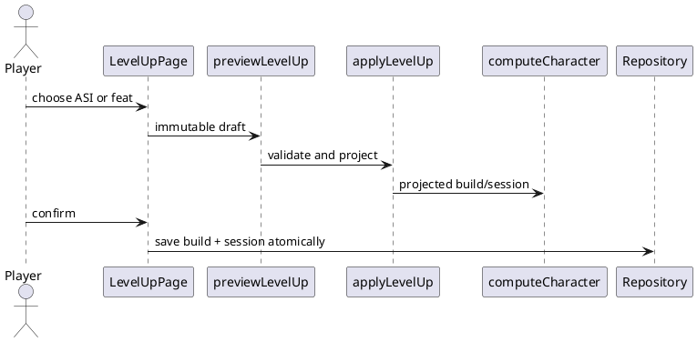

# Iteration 3.5C — Advancement and Session Corrections

## Architecture

Advancement milestones are declared in `advancementDefinitions`; a choice is an append-only `CharacterAdvancementChoice`. `applyLevelUp` validates the transition and choice, creates a new build and session, and never mutates its inputs. `previewLevelUp` calls that same transition and computes before/after characters with the rules engine.

## Advancement flow

The milestone definition determines whether a choice is required. ASIs accept either one +2 increase or two distinct +1 increases, enforce the score cap, and flow through normal derived-stat calculations. General feats are resolved from the supported rule registry, validate availability, and retain nested selections and source level in history.

## Conditions flow

Conditions are rendered as clickable, no-wrap labels in a responsive CSS grid. The generic rest transition preserves conditions on a Short Rest. A Long Rest preview reports active conditions and execution consumes that same transition result to clear them.

## Maximum HP flow

Calculated Maximum HP remains derived from the build. Session adjustment and its optional reason are session state. Effective Maximum HP is their sum. Adjustment commands are immutable, reject invalid totals, atomically clamp Current HP, and integrate with undo/persistence. Healing and Long Rest use the effective maximum. Long Rest deliberately preserves the adjustment.

## Implementation Status architecture

`applicationImplementationStatus` is the single source of milestone copy and feature names. The responsive Home page panel renders it directly; this README records the same Iteration 3.5C capability set. Future milestone reports update the shared module.
