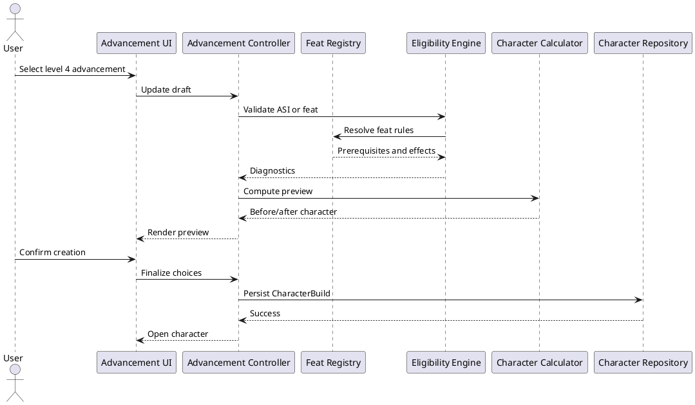
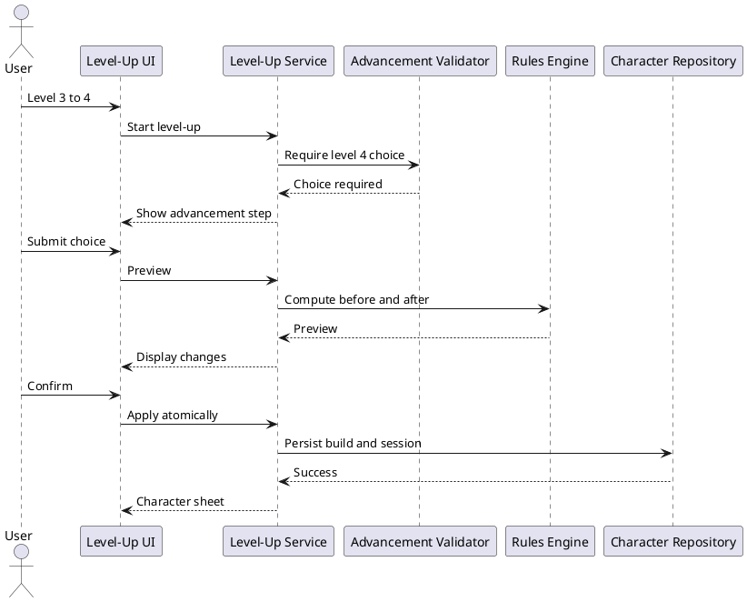

# Iteration 3.5C — Druid advancement, ASI, feats, and danger tokens

## Architecture

Druid advancement milestones are declared as immutable data in `advancementDefinitions`. A `CharacterAdvancementChoice` records the class, milestone level, and a discriminated ASI or General Feat choice. Builds persist only these source decisions and their existing canonical rule inputs; eligibility and previews are computed. Creation, level-up, and required-choice resolution call domain services rather than reproducing rules in React.

ASI accepts exactly one +2 increase or two distinct +1 increases and applies a normal maximum of 20. `validateAdvancementChoices` processes level 4 before level 8 so stacked changes are cap-checked. The build retains the milestone choice, which provides an explanation source alongside the effective score used by the current calculator.

The typed General Feat registry keeps category, repeatability, prerequisites, nested choices, effects, capability requirements, short original summaries, and source metadata. Enabled verified feats are Resilient, Skill Expert, and Tough. Tough remains non-repeatable, so a Farmer character cannot select it again. Resilient and Skill Expert use typed ability/save/skill selections. Crafter and Weapon Master remain visible only as unavailable catalog entries because their engines are not installed.

Creation hides Advancement below level 4, requires level 4 for levels 4–7, and requires levels 4 and 8 at level 8. Review identifies each source. Level-up shows the milestone control only on 3→4 and 7→8 and its rules-engine preview compares level, ability, spellcasting, perception, HP, proficiency, and spell preparation. Confirmation preserves current HP, temporary HP, spell-slot/resource expenditure, conditions, concentration, inventory, wallet, and prepared spells; it is not a Long Rest.

Schema-4 migration never guesses user choices. It appends ordered `druid.advancement.4` and `.8` required-choice markers while preserving the record. Resolution is immutable and atomic and must handle level 4 before level 8. The reference fixture instead explicitly records Wisdom +2 at both milestones to document its historical result. Ordinary editing/respec remains deferred.

## Danger tokens and audit

Destructive actions use `button.danger` and shared tokens: default `#d91e18`, hover `#b91814`, active `#98130f`, white active text, focus `#ff9c98`, disabled background `#d8aaa8`, and disabled text `#5c1b18`. Delete Character, cart Remove/Clear, inventory removal, reset, and destructive overwrite confirmations use this semantic variant. Back, Cancel, ordinary primary/navigation actions, and resource-spend controls are unchanged.

## Creation sequence

## Level-up sequence

## Coverage and deferrals

Automated tests cover milestone requirements, ASI forms/caps/stacking/immutability, feat availability and nested validation, preview and session preservation, migration idempotence/order, reference choices, and semantic danger tokens. Manual browser checks cover the wizard, review, level-up, resolution affordances, and destructive states. Levels above 8, multiclassing, subclass changes, retraining/respec, automatic optimization, unverified feats, crafting, and weapon mastery are deferred.
