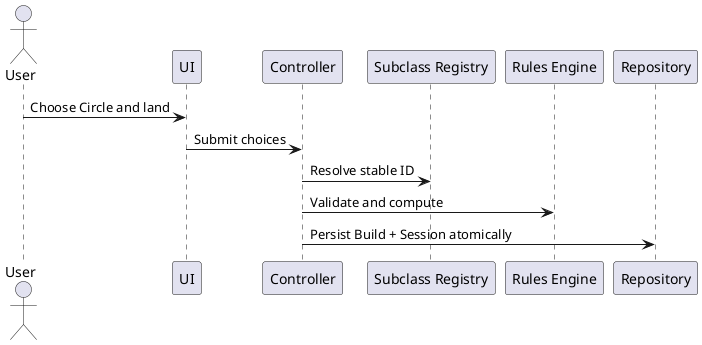

# Iteration 3.5D — Druid subclass and Circle of the Land

Circle of the Land is the sole installed subclass and unlocks at Druid level 3. Its stable `circle-of-the-land` ID is persisted in `CharacterBuild.class.subclassId`; the selected Arid, Polar, Temperate, or Tropical land is independently persisted in `CharacterSession.selections`. The immutable subclass and land registries contain verified source metadata and remain free of React and browser dependencies.

Creation hides the Subclass step below level 3 and requires explicit subclass and land choices from level 3 onward. Level-up requests both choices only while crossing level 3 and applies build and session changes together without resting or replacing live state. Existing high-level records are migrated to ordered required-choice markers rather than receiving an inferred Temperate choice. The reference fixture records Circle and Temperate explicitly.

Circle spell grants are structured rule-registry entries. The pure resolver gates them by Druid level and active land, deduplicates spell definitions, and marks them always prepared and excluded from the ordinary preparation limit. Computation retains subclass source information. A confirmed Long Rest may replace only the session land for a Circle character; invalid choices reject the transition without mutation. Transition helpers compute added and removed grants from the same resolver. Existing HP, spell-slot, resource, condition, Wild Shape, and immutable-rest behavior remains in place.

Typed subclass and creation diagnostics cover early, missing, unknown, mismatched, corrupt, and invalid-land states with human-readable messages. Vitest coverage exercises registry identity, validation, all lands, level gating, preparation flags, migration, level-up atomicity, and Long Rest changes.

