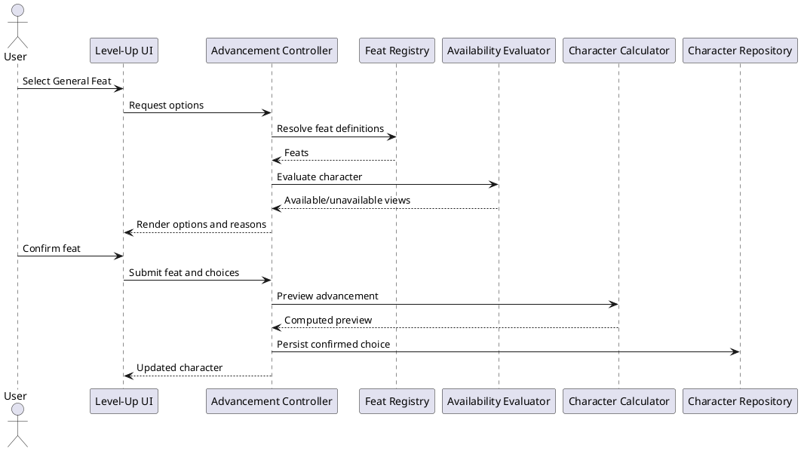
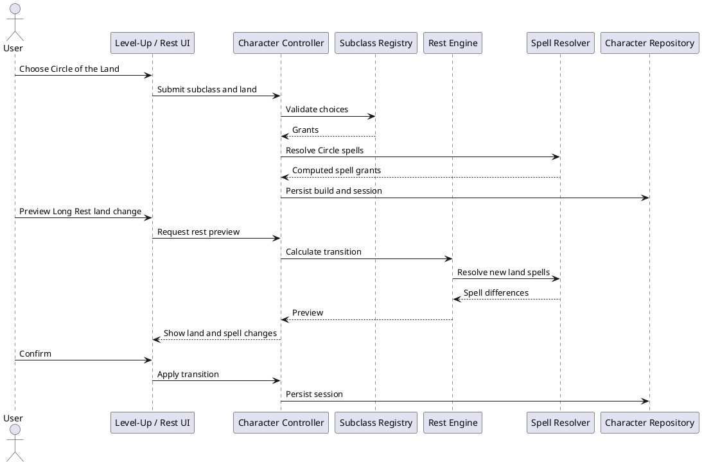

# Iteration 3.5D — Druid subclass and General Feats

## Scope and architecture

The former level-up control constructed a single `tough` option in React. The new immutable General Feat registry owns stable IDs, prerequisites, repeatability, typed nested choices, capability requirements, summaries, and verified source metadata. Domain availability evaluation divides installed feats from structured deferred catalog entries and resolves ownership from all feat sources. Resilient and Skill Expert are selectable; Tough is selectable only when it is not already owned. Ability Score Improvement remains the separate, repeatable level-4/8 advancement path.

Weapon Master is visible but unavailable because Weapon Mastery is not implemented. Crafter is visible but unavailable because crafting is not installed. No deferred feat is persisted or applied. Nested ability, saving-throw, skill, and expertise choices are validated before the calculation preview and stored with that advancement level.

## Circle of the Land

The generic subclass registry installs exactly one subclass: `druid.circle-of-the-land`, for Druid level 3. The choice is explicit and permanent. Its initial land is required in the same level-up transaction. The build stores the subclass ID; the session stores only the current stable land ID (`arid`, `polar`, `temperate`, or `tropical`). A Short Rest cannot modify it. A Long Rest draft may retain or change it and applies the draft only after confirmation.

Circle spells are derived from subclass, Druid level, current land, and verified spell grants. Resolution deduplicates spell IDs, exposes structured subclass/land provenance, marks each spell always prepared, and excludes it from the normal prepared limit. Transition preview and execution use the same before/after selection.

## Migration and diagnostics

Legacy display and rule IDs map unambiguously to the stable subclass ID. Level 1–2 Druids remain unchanged. Level 3+ Druids missing a subclass or land receive human-readable required-choice diagnostics; no land is guessed. Inventory, wallet, HP adjustment, advancement history, prepared spells, and session state are copied untouched. Non-repeatable feat effects are deduplicated during calculation and invalid repeats are rejected before persistence.

## Known limitations and coverage

Only Circle of the Land and levels 1–8 are installed. Crafting, Weapon Mastery, combat automation, multiclassing, and additional classes/subclasses remain out of scope. Automated tests cover registry uniqueness, availability, nested choices, feat effects, subclass validation, every land’s spell grants, land transitions, migration, status presentation, existing Druid rules, persistence, and routing. Manual browser review covers the accessible available/unavailable grouping, permanent subclass confirmation, level-up preview, Long Rest draft, Spellbook badges, refresh persistence, and recovery copy.
