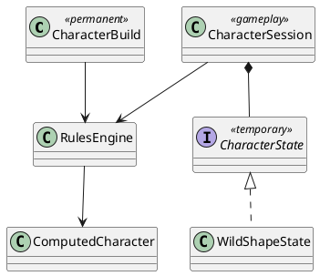

# Iteration 3.5F — Character State and Wild Shape

## Architecture

`CharacterBuild` remains the immutable permanent choice record. `CharacterSession` owns mutable gameplay resources and one generic `CharacterState`; it never embeds another build or creates a Beast character. The rules engine combines these inputs into `ComputedCharacter.activeState` and eligible forms. A normal state has no payload. A Wild Shape state has a typed immutable payload containing the registry ID, current and maximum Beast HP, timestamp, source feature, duration and level metadata.

## Transformation and overlay

Only verified forms within the Druid level's CR ceiling are returned, so React neither calculates legality nor displays illegal choices. Preview is an application calculation over the computed view and lists AC, movement, size, form and resource deltas before confirmation. Confirmation spends one use and installs the state atomically.

The normal sheet never navigates away. The overlay substitutes Beast AC, movement, and physical ability scores while mental abilities, spellcasting, Druid features, inventory and resources remain the character's. `ActiveCharacterStateCard` consumes a generic presentation object and is the sole current-state display. Its provider supplies Wild Shape labels and the optional verified Beast. The detail dialog lists statistics, skills, senses, actions and traits; actions are informational.

## HP, recovery, and persistence

Damage first consumes temporary HP and then active Beast HP. A hit equal to or greater than remaining Beast HP reverts automatically and transfers only overflow to character HP. Beast healing cannot exceed Beast maximum HP. Manual reversion changes no character HP and grants no healing. Long Rest reverts before recovering resources; Short Rest restores the configured Wild Shape use. State changes use immutable snapshots, participate in existing session history/undo, and are copied into the authoritative character record so refresh reconstructs the exact state.

## Extensibility and limitations

The discriminated `CharacterState` union and computed presentation boundary are intentionally reusable for future state providers. Polymorph, Shapechange, mounts, companions, familiars and other transformations are **not** implemented in this iteration. The registry is intentionally small, verified and production-oriented rather than a bulk Monster Manual import. Beast attacks remain informational.
