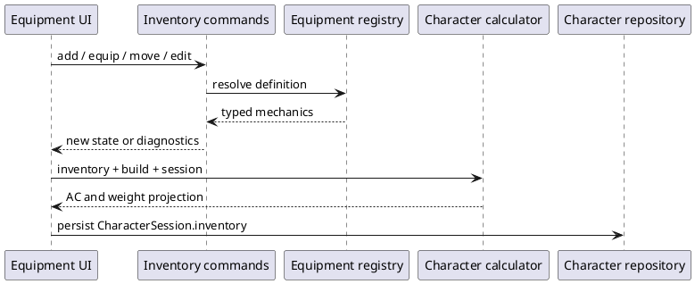

# Iteration 3B — Equipment and inventory

## Architecture

Equipment definitions are immutable, typed discriminated unions in the domain layer. The production registry contains only the compact mechanical fields used by the supported Druid/Farmer path; persisted characters keep definition IDs, never copied definitions. `CharacterSession.inventory` is the authority for mutable ownership because quantities, equipment, containers, currency, notes, and attunement change during play. `ComputedCharacter.equipment` is a disposable projection.

The inventory command layer validates an operation and returns either a new inventory plus changes or the unchanged inventory plus typed diagnostics. Commands do not mutate their arguments. React only submits these commands and renders their results. A framework-free presentation adapter recalculates the inventory portion of the existing view model.

## Definitions and starting equipment

The registry covers leather and hide armor, a shield, sickle, quarterstaff, spear, sling, Druidic Focus, Herbalism Kit, backpack, bedroll, rations, and hempen rope. Statistics are limited to verified Free Rules 2024 table mechanics and concise source metadata. The supported creation preset resolves to real instances: equipped hide armor, shield, and focus; a quarterstaff, kit, backpack, bedroll, ten rations, and rope. Currency starts at zero because no non-zero amount was verified for this combined preset.

## Armor Class integration

Equipped inventory is resolved into the existing generic `ArmorClassSource` union. The existing calculator chooses between the unarmored candidate and equipped armor, applies the armor's Dexterity behavior, then applies the one equipped shield. There is no inventory-owned final AC and no second AC formula. Legacy records without inventory retain their old build input only until record migration installs the fallback structured preset.

## Containers, weight, currency, and attunement

An item can point to one owned container instance. Commands reject missing containers, self-containment, cycles, and removal of non-empty containers unless contents are explicitly moved to root. Capacity is intentionally not modeled. Weight selectors multiply verified unit weight by quantity and expose carried, stored, and owned totals without persisting any total.

The integer CP/SP/EP/GP/PP wallet has independent denomination commands and never performs implicit conversion. Attunement is modeled on definitions and instances, has a persisted limit (three), and atomically rejects unsupported, duplicate, or over-limit attunement. No production MVP item supports attunement; tests verify the rejection path rather than inventing a magic item.

## Persistence and migration

Character records are schema version 2. Loading a valid schema-v1 record adds the supported fallback inventory; a missing or corrupt inventory is likewise replaced during migration so old characters retain their established AC. Definitions, weight totals, and computed AC are not serialized. Level-up spreads the existing session and therefore preserves inventory, currency, containers, and attunement unchanged.

The older presentation cache remains version 2 for backward UI compatibility. Authoritative created-character records are independently migrated and converted to view models at load time.

## UI and accessibility

The Equipment section groups equipped items, weapons, armor/shields, tools/focuses, gear, and containers. It provides registry search, category filtering, quantity, carry/equip, container, notes, currency, and confirmed removal actions. Semantic headings/lists, named controls, an accessible dialog, an alert region, text warnings, responsive cards, and reachable mobile controls are provided.

## Test coverage

Domain tests cover registry uniqueness and categories, preset resolution, weight, quantity validation, immutability, armor replacement, shield behavior, safe removal, cycles, non-empty containers, denomination independence, attunement rejection, computed AC, and v1-to-v2 migration. Existing suites continue to cover creation, level-up, spells, rest, session state, storage, routing, and UI regressions.

## Known limitations

- This is not a complete equipment compendium and has no purchasing workflow.
- Automated attacks, damage, hand-count rules, ammunition use, magic-item effects, and encumbrance penalties are not implemented.
- Container capacity and nested carried-weight semantics are informational only.
- Proficiency data remains separate from ownership. The current Druid slice does not yet expose a full generic training-warning resolver, so `missing-training` exists in the diagnostic contract but no production preset triggers it.
- Starting currency is zero rather than guessed. Item costs not required by the current UI are omitted.
- Attunement architecture is active, but no unsupported magic item was added merely to demonstrate it.

## Suggested Iteration 3C scope

Add a verified, generic equipment-training resolver and character-facing warning details; introduce user-selected starting-equipment alternatives and verified costs; strengthen corrupt-record reporting with user-visible migration notes; and expand item-detail and attunement UI only alongside verified supported content. Keep attacks, damage, buying, and encumbrance separate projects.
