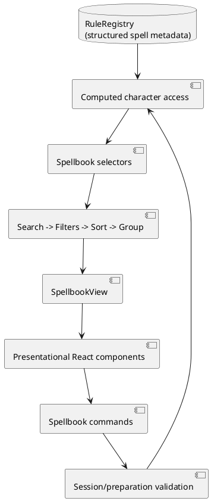

# Iteration 3.3 — Spellbook

## Architecture

The Spellbook is a read-model pipeline. Structured rule definitions and character access feed domain search, filter, sort, and grouping functions. Application selectors expose one immutable `SpellbookView`. Commands validate preparation through the existing validator and persist through `CharacterContext`. React owns only transient query and selection state.

## Filtering pipeline

The pipeline performs normalized name search, then composes preparation, cantrip, ritual, concentration, source, school, level, and availability predicates. It applies one sort mode and groups by level. Filters remain active while search changes. The shared `compareSpells` comparator is the stable tie-breaker and only level/name ordering implementation.

## View model and components

`SpellbookView` contains grouped cards, selected detail, preparation totals, validation messages, result count, and computed slot controls. Cards contain accessibility, status, source badges, tags, and structured mechanics, so components do not derive rules. Desktop uses list/detail columns; narrower displays stack without horizontal scrolling. Buttons, labels, visible focus, text symbols, and disabled states avoid color-only communication.

## Preparation, search, and session state

Only eligible class spells can be toggled. Always-prepared subclass and species grants cannot be manually removed and do not count against the class preparation limit. Slot Spend/Restore shares Session Mode's persisted slot representation. Search is name-only and deliberately does not index copyrighted prose.

## Future extensibility

Source unions reserve feat and magic-item badges, and tags are independently extensible. `SpellDefinition.description` is optional so properly licensed or user-imported content can later appear without changing the view-model architecture; this repository stores no descriptions. Future rulebooks should add structured casting time, range, duration, components, and tags rather than parsing prose.
