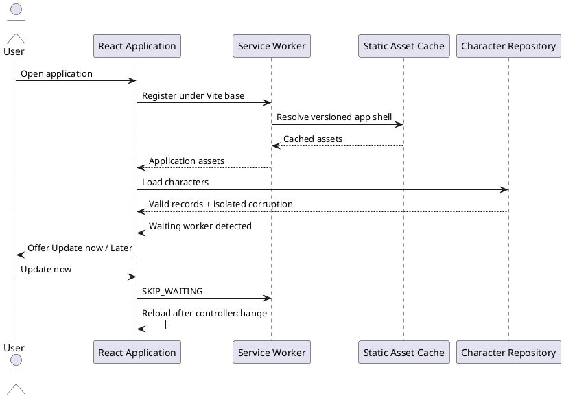
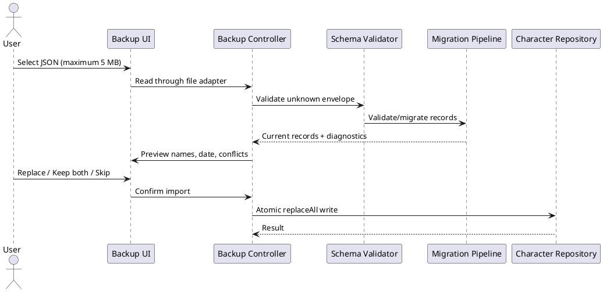

# Iteration 3.4 — release quality

## Architecture and PWA

Release concerns follow the domain/application/infrastructure split. The backup domain owns the stable format and limits; the application controller validates, previews, and applies backups; browser file, persistence, service-worker, and logging operations are adapters. React coordinates these APIs.

The production build emits a relative manifest, original SVG icon, and `sw.js`. The worker precaches the generated same-origin application shell and bundled assets, uses cached `index.html` for navigation fallback, and deletes prior versioned caches. It does not cache backup uploads/downloads, arbitrary cross-origin content, or imported documents. Hash routes reload offline after one successful production load. Development does not register it.

A waiting worker only shows a prompt. **Update now** activates it and reloads on `controllerchange`; **Later** dismisses for the page session. Failed/unsupported registration appears in Settings. The generated version combines package version and build timestamp, without requiring Git metadata.

## Backup, migration, and recovery

Backups use format `characterforge5e-backup`, version `1`, ISO export time, generated app version, and persistent records. They exclude computed projections, React state, undo history, caches, and source documents. JSON is indented UTF-8; filenames are normalized and restricted.

Safety limits are 5 MB, 100 characters, 200-character names, and 1,000 inventory items per character. Validation checks envelope fields/types, dates, versions, unique IDs, record/session shape, and inventory through the migration pipeline. Persistence schema `1` migrates to `2` with safe inventory default diagnostics; current input is idempotent. Invalid raw entries remain stored, are isolated from lists, counted by Storage Health, and can be exported for recovery.

**Replace** retains the imported ID, **Keep both** creates a UUID and “(Copy)” name, and **Skip** leaves existing data. The local repository serializes the completed plan with one `replaceAll` write. Duplication preserves build, preparation, and inventory while resetting HP to computed maximum, temporary HP, slots/resources, concentration, and conditions. Reset requires `DELETE` and removes only owned keys.

## Persistence, print, accessibility, and performance

Session changes update memory immediately and persist on each meaningful interaction. Durability is preferred over speculative debounce; Storage Health probes write support and reports approximate owned-record bytes and valid/corrupt counts.

Print CSS hides navigation, controls, dialogs, banners, and transient UI; removes clipping constraints; and avoids breaks inside grouped content. The browser dialog is the PDF pathway. Accessibility work adds semantic statuses/alerts, explicit button types, labeled import/reset fields, visible focus, touch-sized controls, reduced-motion overrides, accessible lazy loading, and a sanitized application error fallback with reload/list actions.

Spellbook and Settings are route-split. The registry remains bundled for offline creation/play. Production logging suppresses debug/info and accepts only diagnostic codes, app version, and small safe context—not records or backup text.

## Privacy, security, browser policy, and limitations

There is no backend, account, sync, telemetry, analytics, unsafe HTML, or dynamic script injection. Data stays in browser storage unless exported; JSON is untrusted and validated. Storage can be cleared externally, private mode may reject writes, and quota varies.

Current Chromium, Firefox, and Safari support core use. Installation differs: Chromium commonly exposes install events, Safari uses platform UI, and Firefox desktop may not provide equivalent installation. Offline readiness requires a completed online production load. SVG icons are standards-compliant, though older launchers may prefer PNG. Deployed GitHub Pages, physical installation/offline switching, screen-reader combinations, and print pagination require manual release-environment verification.
