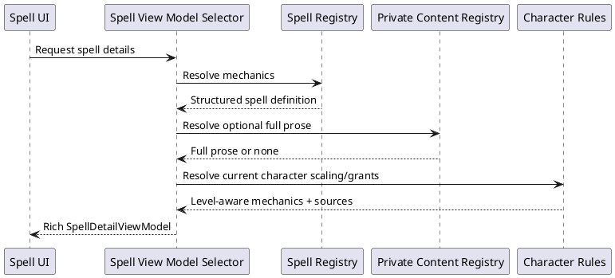

# Iteration 4.0A — complete spell content

## Architecture and source policy

The rule registry owns one normalized definition per reachable spell. Casting time, range, duration, components, attack/save, damage/healing, area, effects, and scaling are domain data; React only formats view models. Public verified mechanics remain usable without private content.

Resolution is deterministic: bundled SRD prose when present, then an installed version-1 private PHB prose entry, then the registry's concise mechanics summary. Rules source and character grant sources are independent, so one spell can show Druid, Circle, species, or Magician badges without duplicate definitions.

Private packs use `characterforge5e-spell-content`, schema version 1, stable spell IDs, a source label, and plain-text descriptions. Validation rejects malformed packs. Packs are local inputs and must not be committed; they never replace mechanics and are never rendered as HTML.

## Structured mechanics and presentation

Casting times, ranges, and durations are discriminated unions. Concentration is carried by timed durations and checked against the spell flag. Dice expressions are shared domain values; centralized formatting and averaging use `(die + 1) / 2`. Character-level scaling selects the last eligible immutable step, while slot scaling records its per-level increment. Builder cards and Spellbook consume selectors rather than parse prose.

Coverage audits require identity, casting time, range, duration, components, useful summary/description, source, and a primary effect. Production placeholder phrases are regression-tested. The coverage whitelist is empty; future exceptions require an ID, missing fields, and reason.

## Flow

## Known gaps and next scope

No reachable spell is whitelisted for a missing critical field. Full copyrighted PHB prose is intentionally absent unless supplied locally. Iteration 4.0B can add a settings import screen and broaden custom structured scaling/effects without unrelated class lists or level 10+ progression.
