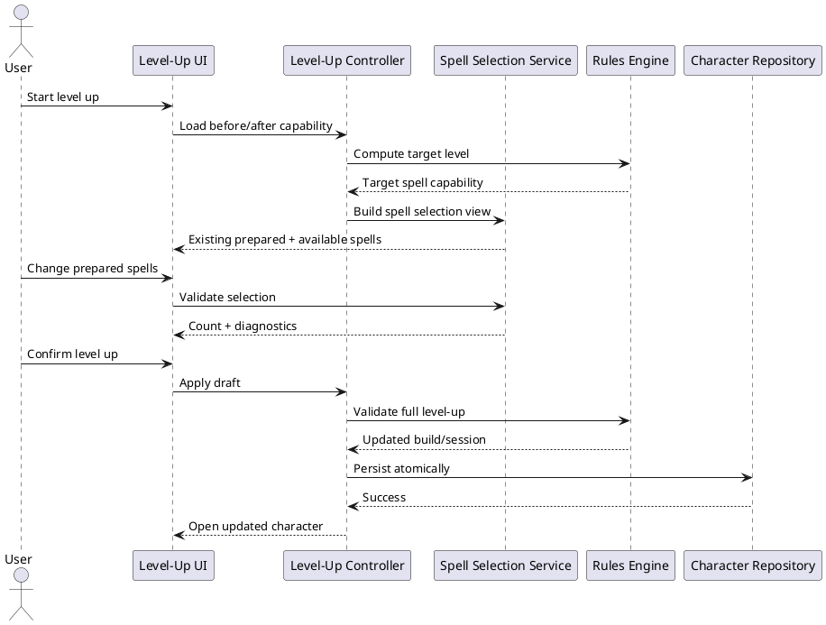

# Iteration 4.0B — manual level-up spell selection

## Behavior and architecture

Level-up compares the before and target computed spell capabilities. Review is relevant when the prepared limit, maximum accessible spell level, normal Druid cantrip allowance, or the derived subclass/species grant IDs change. This comparison is level-independent rather than an 8 → 9 special case.

`LevelUpDraft.spellChoices` contains only normal prepared Druid spell IDs and normal Druid cantrip IDs. It is ephemeral: refreshing or cancelling abandons it and never writes live character state. Existing selections seed the draft without generating replacements or automatically preparing newly accessible spells. If an old ID is invalid it remains in the draft and produces a typed, readable diagnostic.

The target preparation limit and spell level come from Druid progression. Validation requires the verified normal cantrip allowance and complete normal prepared count. Cantrips, the Magician additional cantrip, Circle spells, and Chthonic grants are excluded. Search and filter selectors run outside React and reuse normalized rich spell definitions, detail view models, and the shared spell comparator.

Circle grants are derived from target Druid level, Circle subclass, and the session's current land. The land is not changed during level-up (except the existing initial level-3 choice). Circle spells render read-only as Always Prepared. Chthonic grants are derived from the species option and render read-only as Granted. Neither category is persisted in the build's prepared choices.

The reusable spell diff reports normal preparations removed/added, derived grants removed/added, and newly accessible spell levels. Confirmation validates the complete draft first, creates a new build and session, then performs one repository save. A failed validation performs no save. Cancellation is a navigation with no mutation.

## Tests and limitations

Tests cover generic triggering, level 8 → 9 progression, source exclusion diagnostics, incomplete/duplicate selections, and duplicate-free diffs. Cantrip replacement is not offered because no verified replacement rule is installed. Draft restoration, combat spell execution, concentration automation, and spell effect automation remain deferred.

