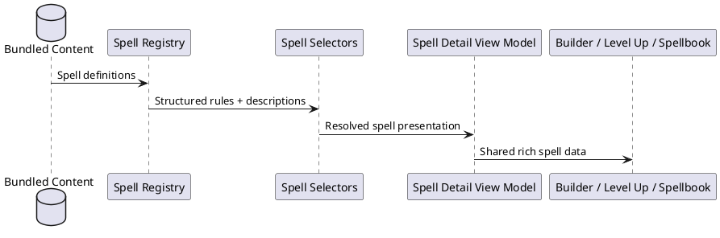
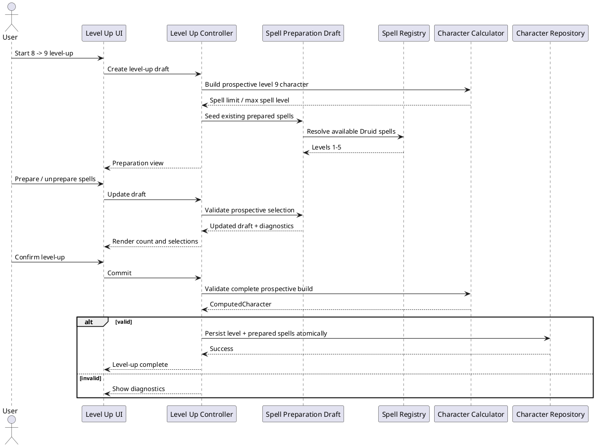

# Stage 4, Iteration 4.0 — rich spells and level-up preparation

## Corrective completion: audited content and compact mechanics

The bundled 2024 registry is the single source consumed by selectors and React. The dependency direction remains **bundled content → registry → selectors → shared presentation → React**; presentation components never import content tables directly.

`auditSpellContent` performs a reusable, conditional audit. Material prose is required only for material-component spells, while damage, healing, attacks, saves, areas, and scaling remain optional when the spell does not use them. The production test deduplicates the Druid list, Circle grants through Druid level 9, Chthonic grants, and Magician-compatible cantrips and requires verified, full content.

Spell mechanics include authored primary effects, structured area geometry, reusable dice expressions, and a symbolic spellcasting-ability modifier. Cantrip dice are selected for the current character level in the shared presentation layer. Compact views expose action, range, concentration/ritual, attack or save, current damage/healing, area, and up to two primary effects without parsing or truncating description prose.

The compact and expanded views share one presentation model across Spellbook, creation, and level-up. Full description DOM is created only after Details is expanded. Incomplete imported or homebrew definitions remain supported: the audit identifies missing content and the existing completeness/fallback presentation remains available; production content does not use it.

No formatted summary, expanded state, or derived grant is persisted, so this pass requires no persistence migration. Content above Druid level 9 and content outside the supported Druid/Circle/Chthonic vertical slice remain outside Iteration 4.0.

## Content and presentation architecture

`SpellDefinition` carries structured casting, component, attack/save, damage, healing, and character-level cantrip-scaling mechanics alongside unbounded authored `description` and optional `higherLevels` prose. Rules calculations consume structured fields only. `content.completeness` (`full`, `summary`, or `mechanics-only`) identifies how much prose is installed without invalidating an otherwise usable spell.

Bundled definitions enter the `RuleRegistry`; application selectors resolve mechanics and typed sources into the shared `SpellDetailView`; React cards consume that view. Creation's ordinary and Magician cantrip pickers, prepared-spell picker, level-up review, and Spellbook therefore share content. Circle and species spells remain derived, read-only grants outside ordinary preparation.

## Level-up transaction

The immutable draft seeds existing ordinary Druid preparations. Validation uses prospective progression (including level-5 access at Druid 9), permits a count at or below the limit, and rejects invalid choices. No draft mutation reaches storage; confirmation sends spell IDs, advancement, and HP through pure preview and one repository save, so cancel/failure preserves build and session state.

## Persistence and boundaries

No character schema or migration changed: only ordinary prepared IDs remain persisted. Expansion state, formatted labels, derived grants, and descriptions do not. Registry access is the seam for future content packs; React does not import a PHB file. Most prior entries had placeholders and no prose. Existing information was preserved, representative verified summaries are marked `summary`, and the rest `mechanics-only`; missing PHB prose was not invented. Background/feat expansion, Circle redesign, weapon attacks, richer Wild Shape, other classes, and levels 10+ remain deferred.
